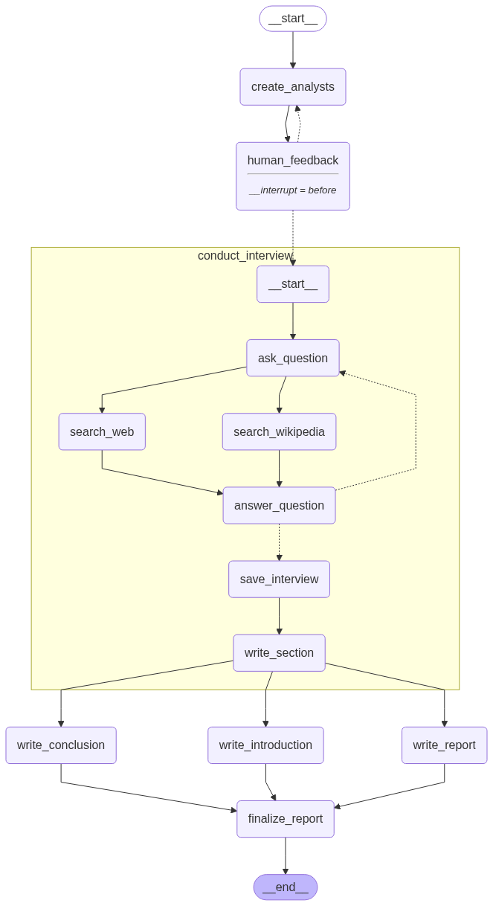

# 🧑‍🔬 Research Automation Multiagent

Este proyecto implementa un sistema multiagente para automatizar entrevistas y generar reportes en procesos de investigación científica, con enfoque en el archivo principal `ai_research_assistant.py`.

## ✨ Descripción

El archivo `ai_research_assistant.py` orquesta el flujo completo de automatización:

- Crea y gestiona agentes analistas.
- Realiza entrevistas automatizadas.
- Recibe retroalimentación humana para ajustar el equipo de analistas.
- Genera reportes técnicos en formato Markdown.
- Visualiza el flujo de agentes mediante gráficos.

## 📂 Estructura y archivos principales

- `ai_research_assistant.py` 🧠: Archivo principal que coordina todo el proceso multiagente.
- `ai_analyst_generator.py` 👨‍🔬: Define la clase `Analyst`, la creación de analistas y la función de retroalimentación humana.
- `ai_interview_generator.py` 🗣️: Construye el grafo de entrevistas y gestiona el flujo de preguntas/respuestas.
- `final_report.md` 📄: Reporte generado automáticamente por el sistema.
- `ai_research_assistant.png` 🖼️: Imagen del grafo de agentes generado por el sistema.

## 🖼️ Figuras generadas

A continuación se muestra una visualización del grafo de agentes generado por el sistema:



## 🚀 Uso

1. Configura tus variables de entorno en `.env` (ver `.env.example`).
2. Instala las dependencias en el repositorio raíz:
   ```sh
   poetry install
   ```
3. Ejecuta el archivo principal:
   ```sh
   python ai_research_assistant.py
   ```
4. El reporte final se guardará en `final_report.md` y el grafo en `ai_research_assistant.png`.

## 🔗 Dependencias clave

- [LangChain](https://python.langchain.com/)
- [LangGraph](https://github.com/langchain-ai/langgraph)
- [OpenAI API](https://platform.openai.com/)
- [Streamlit](https://streamlit.io/) (para interfaces, si se usa)
- [Pillow](https://python-pillow.org/) (para imágenes)
